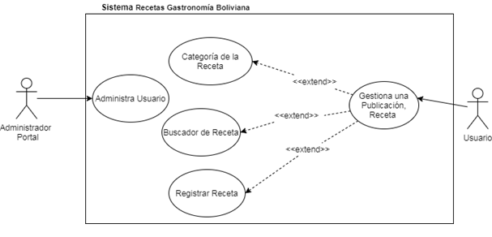

# Recetas Gastronomia Boliviana
## 1.Introduccion
Como bien se sabe la Gastronomía  Boliviana en los últimos años está siendo reconocida con mayor  amplitud a nivel Latinoamérica también es reconocida por la variedad  de platos que se tienen según la zona o departamentos del país, también se  suman la variedad de bebidas  que existen donde se  encuentran como el vino boliviano chicha y el singani.

Hay una variedad de formas de preparación y recetas que existen llevados de familias  en familias y generaciones a generaciones,  pero esto no se da a conocer  a otras persona o gente que desee obtener este conocimiento o tipos de preparación que existen es por esto se procederá a la creación de este portal web donde los usuarios que se  registren podrán compartir sus recetas  y la formas únicas de como  es el proceso preparación de cada plato  estos tendrán la fecha de publicación como la persona que ha publicado la receta. 

Por otra parte personas que estén interesadas en aprender  a preparar la variedad de recetas que existan en este portal podrán hacerlo solo haciendo click en el buscador y escribiendo el plato, bebida que desee preparar o aprender.
## 2.Funcionalidades
- **Buscador de información y recetas que hayan sido posteadas  en el portal web.**

- Base de Datos los registros de  usuarios y Recetas compartidas.

- **Repositorio de Recetas, Registro y anexión con (RR.SS).**

- Reportes de recetas suscritas y publicaciones  hechas por usuarios.

## 3.Casos de Uso

## 4. Maqueta de Proyecto

